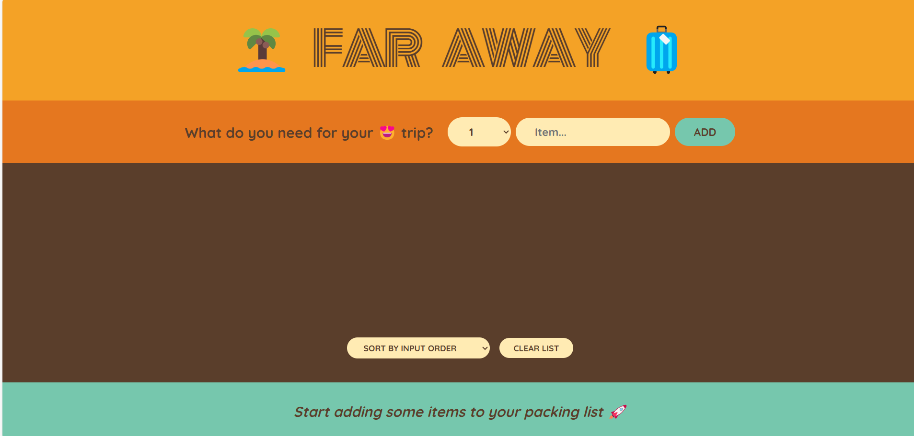
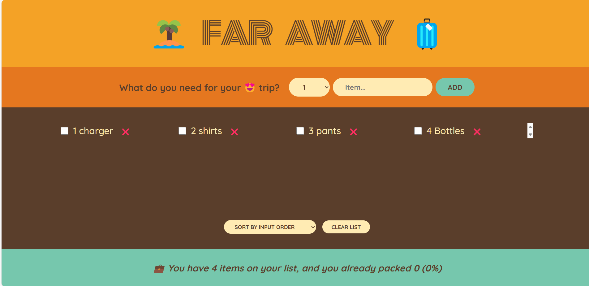
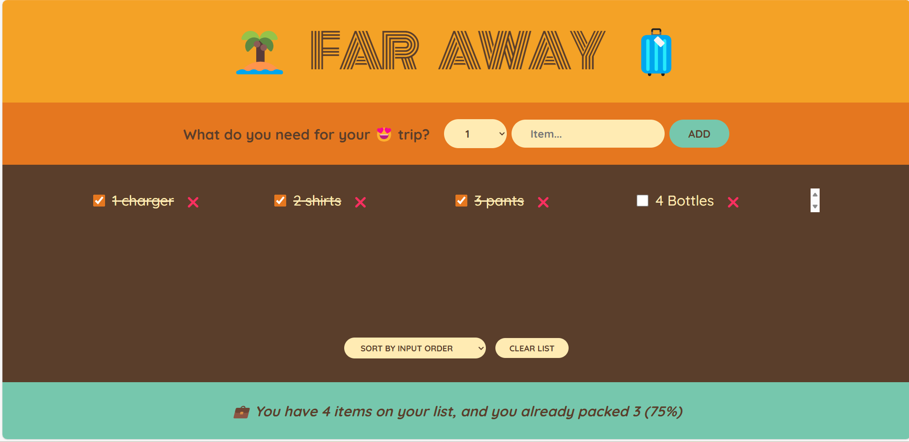

# Travel List App

A React-based application designed to help users manage their travel packing lists. This app allows you to add, update, and delete items, ensuring a well-organized and stress-free travel experience.

---

## 🚀 Features

- **Add Items:** Add items to your packing list with ease.
- **Mark as Packed:** Mark items as packed to keep track of your progress.
- **Delete Items:** Remove unnecessary items from your list.
- **Interactive UI:** User-friendly interface for managing your packing list.

---

## 🛠️ Built With

- **React:** For building the user interface.
- **useState Hook:** For state management.
- **CSS:** For styling the application.

---

## 📸 Screenshots

### Travel List Overview


### Add Item Form


### Mark Item as Packed


---

## 📂 Folder Structure

```
project-root/
├── src/
│   ├── App.js           # Main app component
│   ├── index.js         # Entry point
│   ├── components/      # Additional components (if any)
│   └── styles.css       # Styling
├── public/
│   └── index.html       # HTML template
├── assets/              # Screenshots and images
│   ├── travel-list-overview.png
│   ├── add-item-form.png
│   └── mark-item-packed.png
└── README.md            # Project documentation
```

---

## 🧑‍💻 How to Run the Project

1. **Clone the repository:**
   ```bash
   git clone https://github.com/your-username/travel-list-app.git
   ```

2. **Navigate to the project directory:**
   ```bash
   cd travel-list-app
   ```

3. **Install dependencies:**
   ```bash
   npm install
   ```

4. **Start the development server:**
   ```bash
   npm start
   ```

5. Open your browser and go to `http://localhost:3000` to view the app.

---

## 🌟 Acknowledgments

- Inspired by the need for a simple and effective travel packing tool.
- Thanks to all contributors and testers for their valuable feedback.
